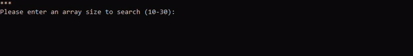

# Ternary Search
A visualization of a twist on the usual binary search! 
- Generates a random sorted array of size 10-30
- Searches for a given/random number using a ternary search.
- Displays a self updating frame as a visualization
- Outputs the index of specified value, if contained in the array

Specifications: 

- Will revert to a linear search when the search range becomes small enough (< 4).
- Requires searches to be within the min, max as checks are simple for out of bounds
- Algoritm runs faster in reality. Using time.sleep for simple visibility
- Conceptually maintains a runtime of O(log n).

Written in Python with a homemade terminal frame

---

Sample of ternary search: 

