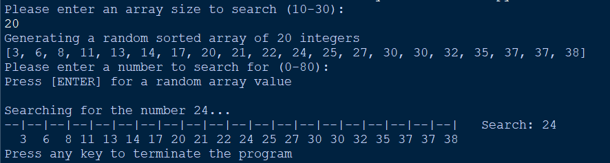

# Ternary Search
A visualization of a twist on the usual binary search! 
- Generates a random sorted array
- Searches for a given number using a ternary search
- Displays a self updating frame as a visualization
- Outputs the specified value, if contained in the array

Written in Python with a homemade terminal frame

---

Currently a work in progress... 

Sample: 

